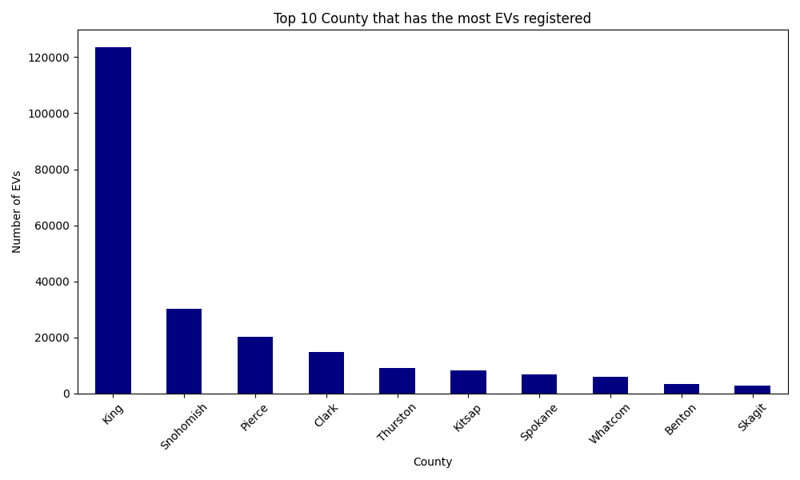
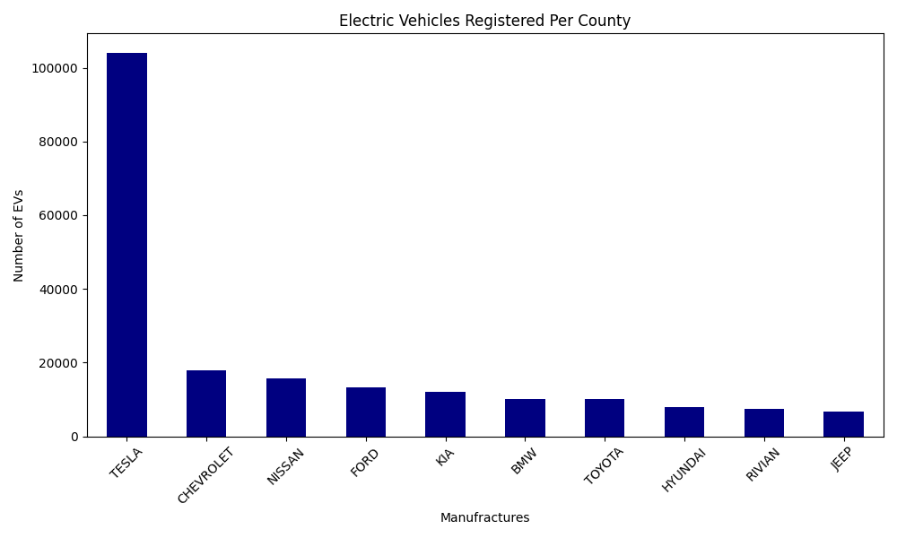
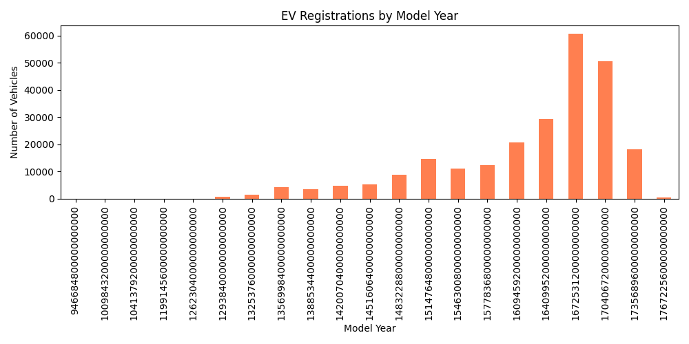

# EV_analysis
# 🚗 Electric Vehicle Analysis in Washington State

This project analyzes publicly available data on electric vehicle (EV) registrations in Washington State to identify trends, top locations, and manufacturers.

## 📌 Objectives
- Understand how many EVs are registered overall
- Identify which counties have the highest EV adoption
- Determine the most popular EV manufacturers
- Visualize EV adoption over time

## 📊 Dataset
- **Source:** [Electric Vehicle Population Data (data.wa.gov)](https://catalog.data.gov/dataset/electric-vehicle-population-data)
- **Format:** CSV
- **Updated:** Monthly
- **Fields used:** Make, Model Year, County, Electric Vehicle Type

## 📂 Project Structure
```plaintext
washington_ev_analysis/
├── data/
│   └── Electric_Vehicle_Population.csv
├── top_10_counties.png
├── top_10_makes.png
├── ev_by_year.png
├── ev_analysis.py
└── README.md
```

## 🛠 Tools Used
- Python
- Pandas
- Matplotlib
- Seaborn

## 🔍 Key Findings
- **Total EVs:** 246,133 registered in WA State
- **Top County:** King County has the most EVs registered
- **Most Common Make:** Tesla is the dominant manufacturer
- **Trend:** EV registrations have steadily increased from 2012 to 2023

## 📈 Sample Visuals
### Top 10 Counties


### Top 10 Manufacturers


### EV Registrations Over Time


## 📌 Future Ideas
- Compare EV vs traditional vehicle growth
- Analyze EV types (BEV vs PHEV) separately
- Build a Tableau or Power BI dashboard

## 📬 Contact
Created by Katie Nguyen — [LinkedIn](https://www.linkedin.com/in/ngoc-kha-tu-nguyen/)  
🔗 GitHub: [katng2886](https://github.com/katng2886)

Feel free to fork this project or reach out with questions or suggestions!

